# Rapport du projet Frontend

## 1) Présentation générale
Ce projet est une application **Angular (standalone)** orientée gestion de la relation client, avec les modules principaux suivants :
- Authentification (connexion / inscription)
- Tableau de bord utilisateur
- Gestion des clients
- Gestion des groupes (catégories)
- Gestion des messages

L'application consomme une API backend via `HttpClient` et s'appuie sur une architecture basée sur des composants Angular + services dédiés à chaque domaine métier.

---

## 2) Architecture de l'application

### 2.1 Stack et structure technique
- **Framework** : Angular CLI 19
- **Architecture** : composants standalone, routage Angular, services injectables
- **Communication API** : `HttpClient`
- **Configuration globale** : `app.config.ts` (router + http client)
- **Environnement** : URL d'API centralisée dans `environment.ts`

### 2.2 Organisation des dossiers
- `src/app/auth-login`, `src/app/auth-register` : écrans d'authentification
- `src/app/dashboard` : statistiques et synthèse utilisateur
- `src/app/mes-clients*` : listing, création, édition des clients
- `src/app/category*` : listing et administration des groupes
- `src/app/message*` : listing, création, édition des messages
- `src/app/services` : couche d'accès aux données (API)
- `src/app/models` : modèles de données TypeScript

### 2.3 Routage (navigation)
Le fichier `app.routes.ts` définit deux espaces :
1. **Espace connecté** via `ConnectLayoutComponent` avec les routes :
  - `/dashboard`
  - `/category`
  - `/category/:id/manage`
  - `/messages`
  - `/messages-create`
  - `/messages/edit/:id`
  - `/clients`
  - `/clients-create`
  - `/clients/edit/:id`
2. **Espace public** :
  - `/login`
  - `/register`

### 2.4 Couche services et réutilisation
Le projet adopte un **service de base générique** `BaseService<T>` qui centralise les opérations CRUD communes :
- `getAll`, `getById`, `create`, `update`, `delete`

Services métiers héritant de cette base :
- `CategoryService`, `CustomerService`, `MessageService`, `DashboardService`

### 2.5 Authentification et session
`AuthService` gère :
- la connexion (`/accounts/login`)
- l'inscription (`/accounts`)
- la persistance locale (token + utilisateur dans `localStorage`)
- les utilitaires de session (`isLoggedIn`, `getToken`, `getUser`)

---

## 3) Guide utilisateur — Fonctionnement de l'application

### 3.1 Écran de connexion (`/login`)

Objectif : permettre à un utilisateur existant d'accéder à son espace.

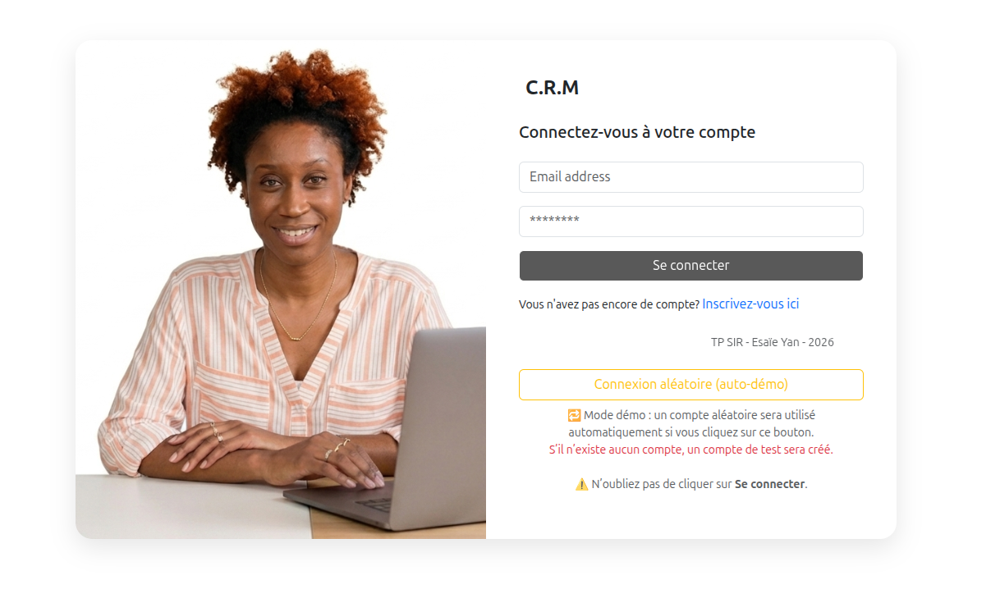

Flux :
1. L'utilisateur saisit son email et son mot de passe.
2. Le front envoie la requête de login via `AuthService`.
3. Si succès, une alerte verte s'affiche brièvement puis l'utilisateur est redirigé vers le dashboard.

> Le bouton **Connexion aléatoire (auto-démo)** remplit automatiquement les champs avec un compte existant en mémoire locale, ou en crée un nouveau si aucun compte n'existe.

---

### 3.2 Écran d'inscription (`/register`)

Objectif : créer un compte (personne physique ou entreprise).

Flux :
1. L'utilisateur choisit son type de profil (**Oui, je suis un humain** ou **Non, je suis une entreprise**).
2. Saisie des informations dans le formulaire qui s'affiche.
3. Soumission et redirection vers la connexion.

> Le bouton **Inscription aléatoire** génère un compte de démonstration en un clic.

---

### 3.3 Tableau de bord (`/dashboard`)

Objectif : afficher une vue synthétique de l'activité utilisateur.

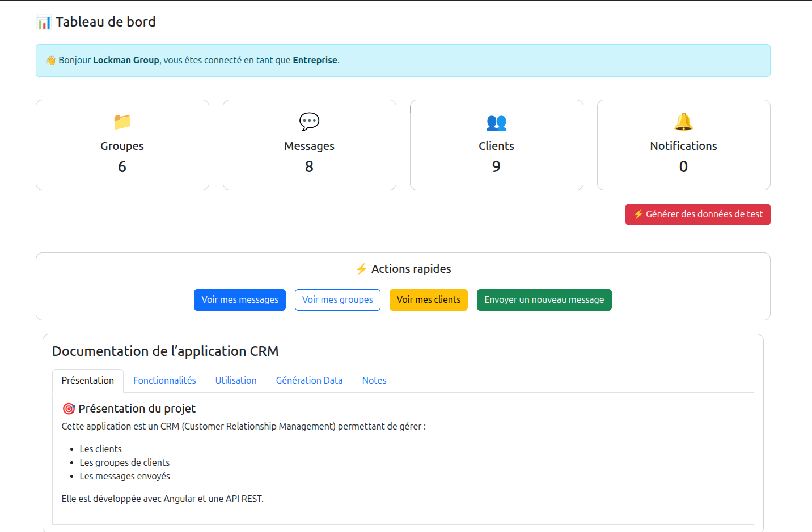

Contenu affiché :
- Nombre de **Groupes**, **Messages**, **Clients**, **Notifications**
- Boutons d'**Actions rapides** : Voir mes messages, Voir mes groupes, Voir mes clients, Envoyer un nouveau message
- Documentation intégrée de l'application (onglets Présentation, Fonctionnalités, Utilisation...)
- Bouton **Générer des données de test** pour peupler rapidement la base

---

### 3.4 Gestion des clients

#### Liste des clients (`/clients`)

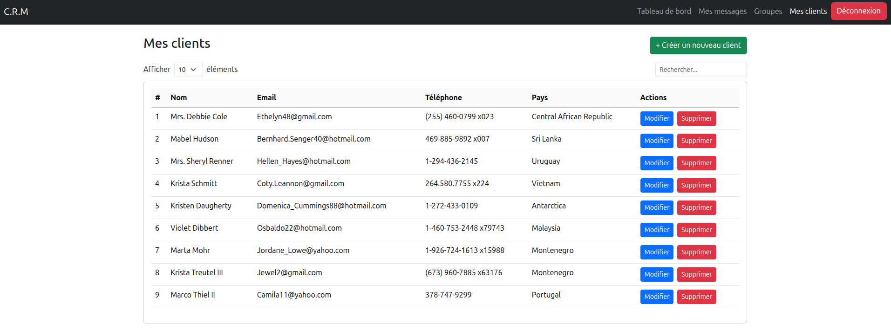

Fonctionnalités :
- Sélecteur **Afficher X éléments** (5, 10, 20, 50)
- Barre de **recherche** en temps réel (nom, email, pays)
- Pagination automatique
- Actions par ligne : **Modifier**, **Supprimer** (avec modale de confirmation)

#### Créer un client (`/clients-create`)

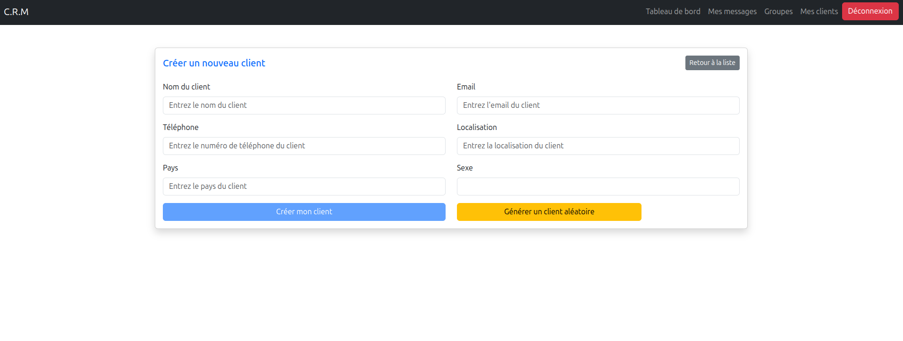

- Formulaire avec validation (nom requis, email valide)
- Bouton **Générer un client aléatoire** pour la démo

#### Modifier un client (`/clients/edit/:id`)

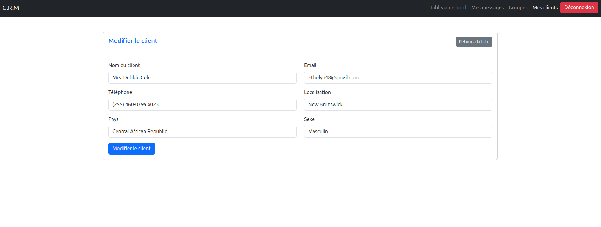

- Formulaire pré-rempli avec les données existantes
- Bouton **Modifier le client** pour valider

---

### 3.5 Gestion des groupes (`/category`)

#### Liste des groupes

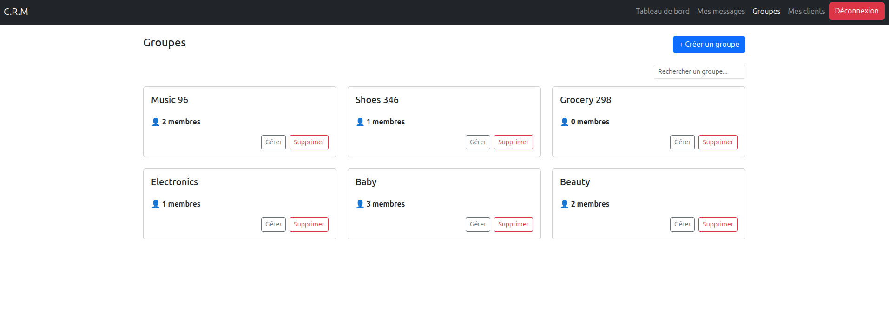

- Affichage en cards avec le nombre de membres
- Barre de recherche
- Actions : **Gérer**, **Supprimer**
- Bouton **+ Créer un groupe** ouvre une modale

#### Créer un groupe (modale)

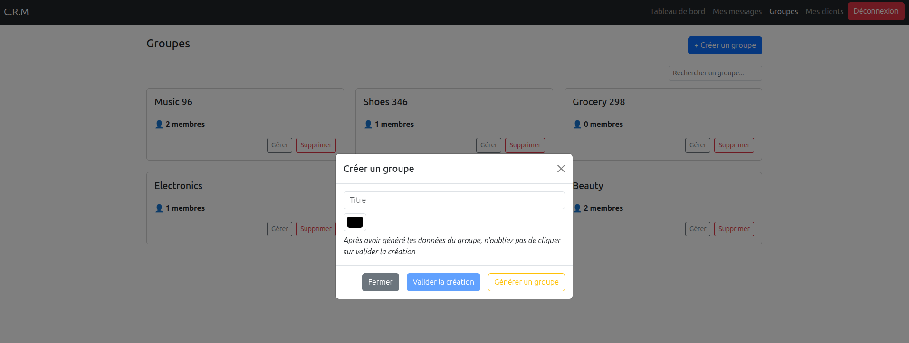

- Saisie du libellé et choix de la couleur
- Bouton **Générer un groupe** pour la démo
- Bouton **Valider la création**

#### Gérer un groupe (`/category/:id/manage`)

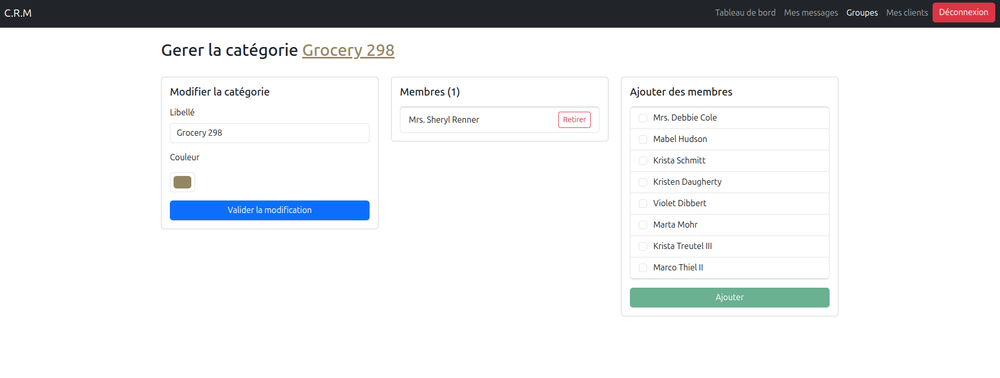

Trois panneaux :
1. **Modifier la catégorie** — libellé et couleur
2. **Membres actuels** — liste avec bouton Retirer
3. **Ajouter des membres** — liste des clients disponibles avec cases à cocher + bouton Ajouter

---

### 3.6 Gestion des messages

#### Liste des messages (`/messages`)

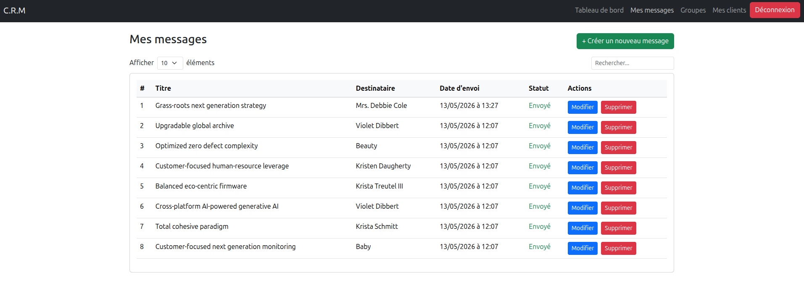

- Sélecteur d'éléments par page + recherche
- Affichage du **vrai nom** du destinataire (client ou groupe)
- Date d'envoi formatée
- Actions : **Modifier**, **Supprimer** (avec modale de confirmation)

#### Créer un message (`/messages-create`)

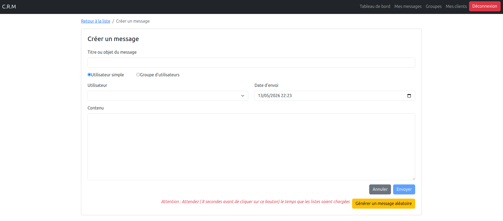

- Choix du type de destinataire (utilisateur simple ou groupe)
- Date d'envoi initialisée à l'heure locale actuelle
- Bouton **Générer un message aléatoire**

#### Modifier un message (`/messages/edit/:id`)

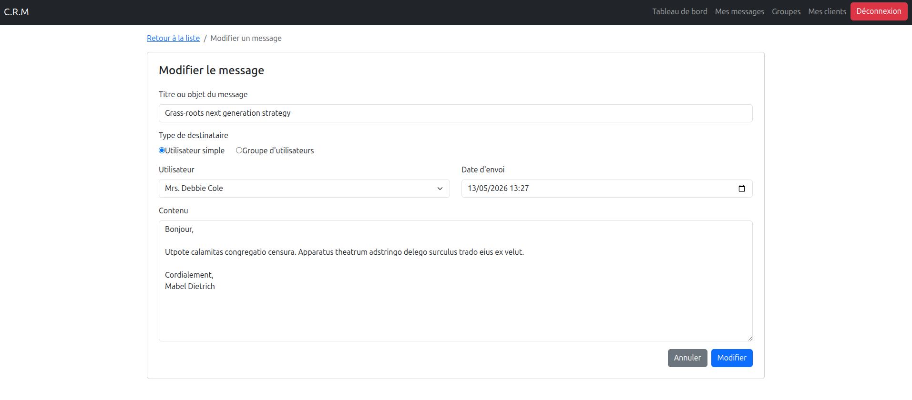

- Formulaire pré-rempli avec les données existantes
- Bouton **Modifier** pour valider

---

## 4) Points forts de l'architecture
- **Modularité** : composants séparés par domaine fonctionnel.
- **Réutilisabilité** : `BaseService<T>` limite la duplication du CRUD.
- **Scalabilité** : ajout de nouveaux modules facilité.
- **Lisibilité** : séparation claire entre UI, routes, modèles et accès API.

---

## 5) Axes d'amélioration recommandés
1. Ajouter un **HttpInterceptor** pour injecter automatiquement le token dans les headers.
2. Mettre en place une gestion uniforme des erreurs API (toasts/messages utilisateurs).
3. Renforcer les validations de formulaires (sync + async).
4. Compléter la couverture de tests unitaires et tests d'intégration.

---

## 6) Conclusion
Ce frontend présente une base solide pour une application métier orientée gestion clients/messages/groupes. L'architecture actuelle favorise la maintenance et l'évolution, tout en restant suffisamment simple pour une prise en main rapide. Avec les améliorations proposées (sécurité, expérience utilisateur, robustesse), le projet peut monter en qualité et en fiabilité pour un usage en production.
